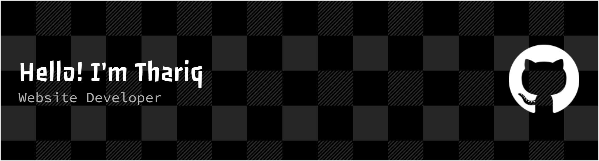

<!-- Header Image -->

  

## Hello! I'm Thariq, an Informatics student from PENS with a deep passion for front-end development. I enjoy turning complex problems into beautiful, intuitive, and responsive web interfaces. Currently, I'm focusing on mastering the React ecosystem and exploring modern web technologies

---

### 🛠️ Skills

  

---

### 📱 Connect With Me

  
  
  

